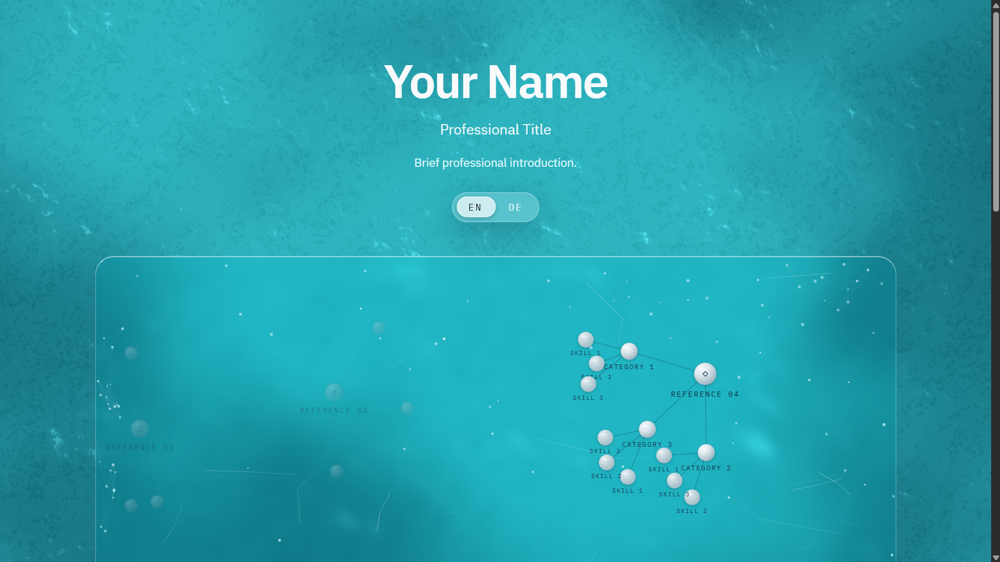
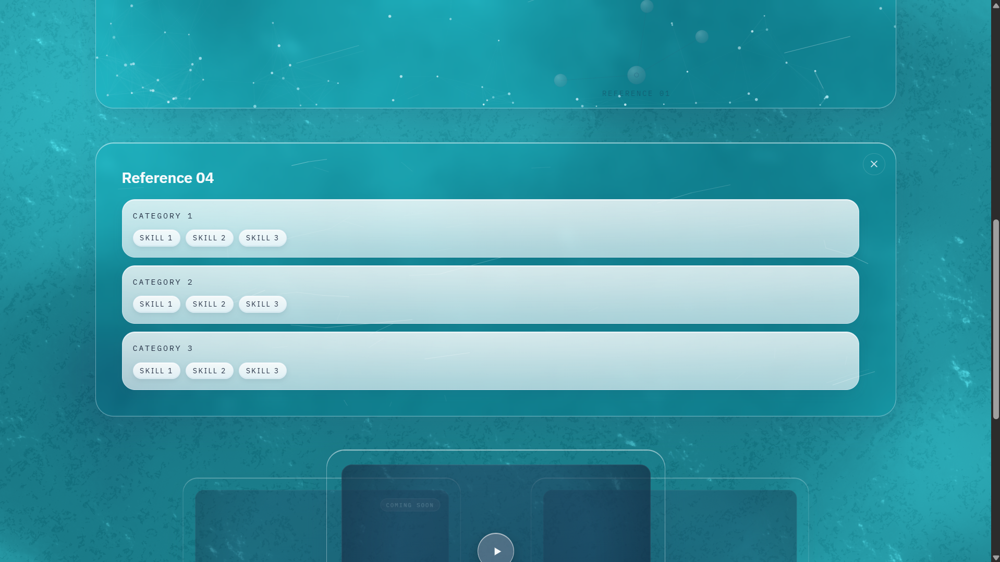
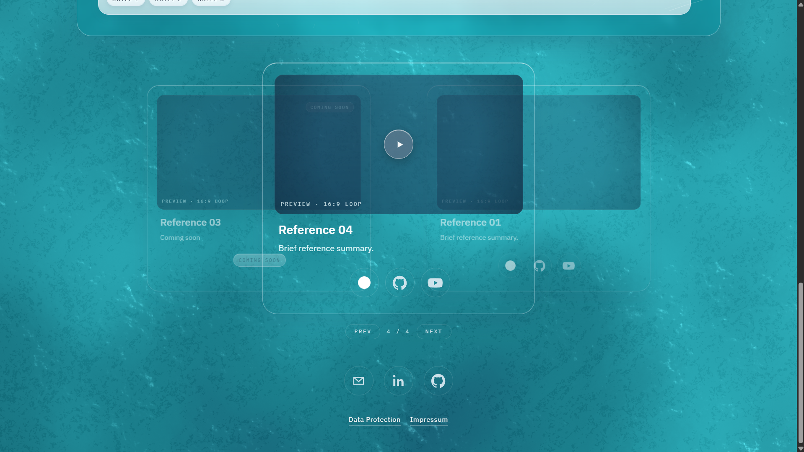
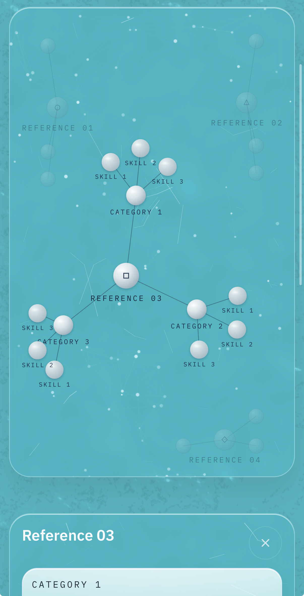
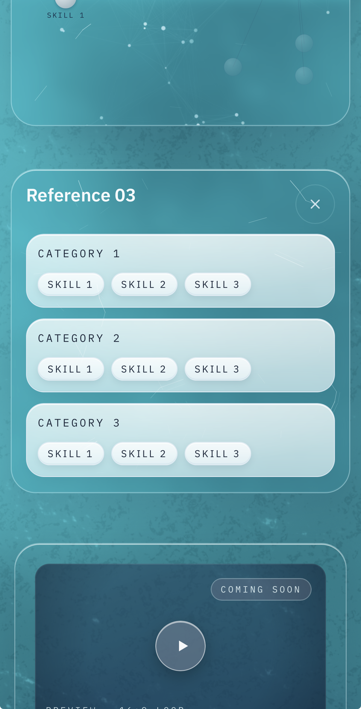
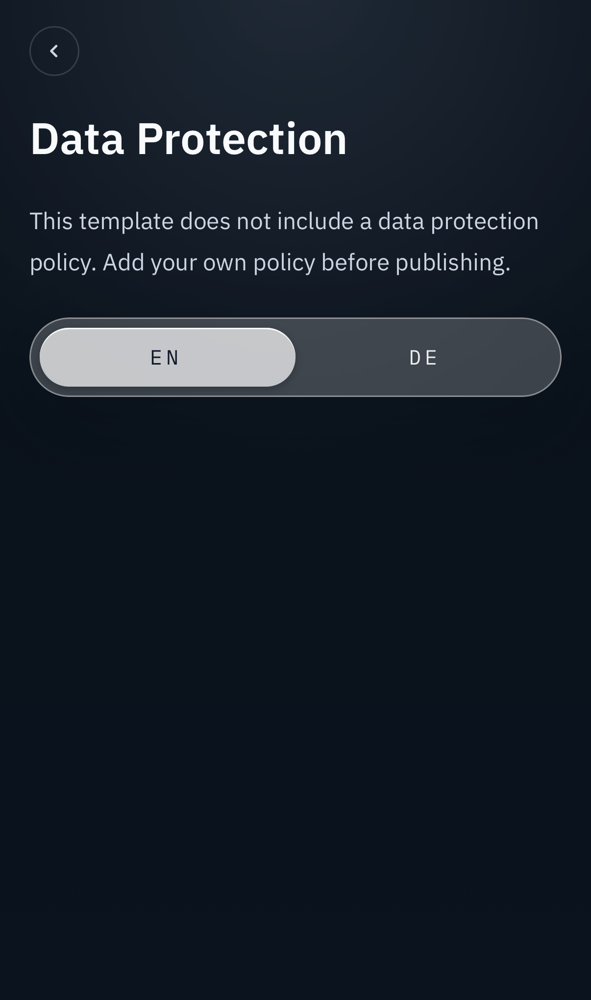

# Gateway -- WebGL Site Template


[](https://github.com/vladyslavm-dev/gateway/actions/workflows/deploy-docker.yml)
[](https://codecov.io/gh/vladyslavm-dev/gateway)
[](https://vladyslavm.dev)
[](https://www.youtube.com/watch?v=ZEH93QwDe8M)

Gateway is a bilingual public template for a WebGL site with graph navigation, demos, legal pages, and contact links. It is built as a static Next.js application with a full-screen Three.js water stage, d3-force graph island, synchronized deck, and placeholder content.

The public template ships without private content. Production content is injected through build-time configuration, while the template keeps generic names, placeholder legal text, geometric graph icons, and placeholder links.

<table>
  <tr>
    <td align="center">
      <br/>
      <sub>Landing Page</sub>
    </td>
    <td align="center">
      <br/>
      <sub>Graph Popup</sub>
    </td>
    <td align="center">
      <br/>
      <sub>Deck View</sub>
    </td>
  </tr>
  <tr>
    <td align="center">
      <br/>
      <sub>Mobile Graph</sub>
    </td>
    <td align="center">
      <br/>
      <sub>Mobile Deck</sub>
    </td>
    <td align="center">
      <br/>
      <sub>Mobile Legal Page</sub>
    </td>
  </tr>
</table>

## Features

### WebGL Water Stage

The background runs inside an isolated world frame with React Three Fiber, Three.js shader passes, framebuffer simulation, poster fallback, and WebGL context recovery. The page waits for textured frames before lifting the loading scrim so the first visible state is stable.

### WebGL Graph

Entries, categories, and skills are rendered as a d3-force SVG graph. Nodes use measured label padding, wall clamps, stable quadrants, keyboard-safe popup behavior, and mobile-specific layout constants.

### Synchronized Deck

The graph and deck share active entry state. Selecting a graph entry moves the deck to the same entry, and deck navigation updates the graph focus. Desktop uses GSAP slot motion, while mobile keeps the deck compact and stable.

### Template And Production Modes

`PLACEHOLDER_MODE=true` keeps the public template generic. `PLACEHOLDER_MODE=false` requires real contact and legal values at build time. Missing production values fail the build instead of silently publishing placeholder legal or contact data.

### Bilingual Routes

English and German routes share the same structured content model. Legal pages are route-aware, render placeholder warnings in template mode, and keep their own dark visual treatment separate from the water stage.

### Mobile Browser Finish

The layout uses `viewport-fit=cover`, safe-area padding, large-viewport water fallbacks, and a water-toned root background so iPhone Safari, Chromium mobile browsers, and landscape modes do not expose dark page chrome.

### Static Export

Next.js builds a static export served by nginx. Caddy handles TLS and edge routing.

## Architecture at a Glance

```
+----------------------------------------------------------+
|                         Caddy                            |
|       TLS termination, www redirect, service routing     |
|       example.com/* -> Gateway static export             |
+----------------------------+-----------------------------+
                             |
                    +--------v---------+
                    | nginx static UI  |
                    | Next.js export   |
                    +--------+---------+
                             |
        +--------------------v--------------------+
        |              Gateway Shell              |
        |  localized routes, legal pages, contact |
        |  graph state, deck state, config guard  |
        +----------+-------------------+----------+
                   |                   |
        +----------v----------+  +-----v----------------+
        | d3-force SVG graph  |  | React deck           |
        | entry/category      |  | preview cards        |
        | skill nodes         |  | links and media      |
        +---------------------+  +----------------------+
                   |
        +----------v----------------+
        | /world-frame/             |
        | Three.js water simulation |
        | poster + context fallback |
        +---------------------------+
```

**Build flow:**
1. CI installs frontend dependencies with `npm ci`.
2. Vitest runs unit and component tests with LCOV coverage.
3. Next.js exports the localized static site.
4. Playwright validates the static preview.
5. Docker builds the nginx image and pushes to Docker Hub.
6. GitHub Actions deploys through SSH and reloads Caddy.

### Why Static Export

Gateway is a static entry point, not a data service. Static export removes runtime application state, keeps legal routes crawlable, and lets the same Docker image serve the template or production build through build-time configuration.

### Performance Choices

- Full-screen water is isolated from the main route tree.
- Water shader waits for ready frames before reveal.
- Poster fallback covers missing WebGL and context loss.
- Graph labels are measured before wall clamp math.
- Mobile graph and deck use separate layout constants.
- Deck animation is disabled on mobile to avoid scroll jank.
- Static export removes server rendering work after build.
- Root background and fallbacks are tuned for mobile browser chrome.

### Runtime Checks

| Concern | Check |
|---------|-----------|
| Placeholder leaks | Production mode throws on missing required env values |
| Legal publishing | Template legal pages show explicit placeholder warnings |
| Browser chrome gaps | Water-toned root and fallback layers cover exposed areas |
| Graph overflow | Label-aware wall clamps and mobile-specific force constants |
| WebGL loss | Poster fallback plus context restore handling |
| Link safety | Template mode uses placeholder links |
| Deployment parity | CI runs lint, coverage, static build, and E2E before deploy |

### Framework & Language Features

**Next.js 16 + React 19**

- App Router with localized route groups.
- Static export for nginx delivery.
- Route-level metadata, manifest, robots, and sitemap.
- Server-only config resolution for build-time env guards.
- React state for synchronized graph and deck selection.
- Client components for WebGL, graph, deck, and motion.

**Motion and Graphics**

- Three.js shader simulation through React Three Fiber.
- d3-force graph layout with entry, category, and skill nodes.
- GSAP deck slot transitions on desktop.
- SVG graph icons and CSS-only template card placeholders.
- Canvas/WebGL poster fallback rendering.

---

## Repository Structure

```
gateway/
├── .github/
│   └── workflows/
│       └── deploy-docker.yml          # CI: lint, coverage, static build, E2E, deploy
│
├── frontend/
│   ├── e2e/                           # Playwright static-preview tests
│   ├── public/stage/world/            # water normal + poster assets
│   ├── scripts/                       # static preview helpers
│   ├── src/
│   │   ├── app/                       # localized routes, legal pages, world frame
│   │   ├── components/
│   │   │   ├── legal/                 # legal page renderer
│   │   │   ├── layout/                # language and preserving links
│   │   │   ├── projects/              # graph island and cards
│   │   │   ├── sections/              # hero, graph/deck, contact sections
│   │   │   └── world/                 # water, glass slabs, loading scrim
│   │   ├── lib/                       # config, routes, i18n, graph state
│   │   └── locales/                   # English and German dictionaries
│   ├── next.config.ts                 # static export config
│   ├── nginx.conf                     # static nginx routing
│   └── package.json
│
├── Caddyfile                          # TLS and Gateway routing
├── Dockerfile                         # static build + nginx runtime
├── docker-compose.yml                 # production Gateway edge stack
├── docker-compose.local.yml           # local preview stack
├── THIRD_PARTY_LICENSES.md
├── LICENSE
└── README.md
```

---

## Tech Stack

### Frontend

| Component | Technology |
|-----------|------------|
| Framework | Next.js 16 |
| Runtime | React 19 |
| Language | TypeScript strict mode |
| Styling | Tailwind CSS v4 |
| Fonts | IBM Plex Sans + IBM Plex Mono |
| Static output | Next.js export |
| Testing | Vitest + React Testing Library + Playwright |
| Coverage | V8 LCOV + Codecov |

### Motion

| Component | Technology |
|-----------|------------|
| Water stage | Three.js + React Three Fiber |
| WebGL helpers | `@react-three/drei` |
| Graph layout | d3-force |
| Deck motion | GSAP |
| Visual surfaces | SVG, Canvas, CSS glass surfaces |

### Infrastructure

| Component | Technology |
|-----------|------------|
| Runtime image | nginx 1.29 Alpine |
| Edge proxy | Caddy 2 |
| Containers | Docker + Docker Compose |
| CI/CD | GitHub Actions |
| Deployment | SSH to VPS |
| TLS | Caddy automatic HTTPS |

---

## Getting Started

### Prerequisites

- Node.js 24.14.1.
- npm 11.6.2.
- Docker and Docker Compose for container checks.
- Chromium-based browser for Playwright.

### Local Development

```bash
git clone https://github.com/vladyslavm-dev/gateway.git
cd gateway/frontend
npm install
npm run dev
```

Open `http://localhost:3000/en/` for the English template route or `http://localhost:3000/de/` for the German route.

### Static Preview

```bash
cd frontend
npm run build
npm run preview:static
```

The static preview runs on `http://127.0.0.1:3200`.

### Production

Docker Compose deployment is represented in CI/CD. Production values are supplied at build time.

### Deployment Shape

| Mode | Purpose |
|------|---------|
| `npm run dev` | Next.js local development |
| `npm run preview:static` | Local static export preview |
| `docker-compose.local.yml` | Local container preview |
| `docker-compose.yml` | Production static Gateway behind Caddy |

Gateway is built as a static nginx image. Caddy terminates TLS and routes traffic from one edge stack.

---

## Testing

Two layers of automated tests cover config behavior, rendering, graph/deck state, WebGL fallback, and static route behavior.

### Full Local Test Matrix

```bash
cd frontend
npm run lint
npm run test:coverage
npm run build
npm run preview:static
npm run test:e2e
```

### Unit And Component Tests -- 43 Tests

Representative coverage:

- Site config and production env guards.
- Locale routing, metadata, legal page rendering, and placeholder mode.
- Contact links and preserving navigation behavior.
- Active entry state and graph/deck synchronization.
- WebGL support detection, water fallback, and context recovery.
- Deck motion wrappers and mobile behavior.

Coverage output: `frontend/coverage/lcov.info`.

### E2E -- 5 Playwright Scenarios / 10 Project Runs

`gateway.spec.ts` validates root redirect behavior, localized routes, legal links, deck cards, world-frame rendering, WebGL context recovery, and graph popup keyboard behavior.

Playwright runs those scenarios against desktop and mobile Chromium projects. The WebGL recovery scenario is desktop-only, so the expected local result is 9 passed and 1 skipped.

Playwright expects the static preview at `http://127.0.0.1:3200`.

---

## CI/CD

One GitHub Actions workflow follows the pattern: **Test -> Build -> Push -> Deploy**.

| Workflow | Trigger | Target |
|----------|---------|--------|
| `deploy-docker.yml` | Push to `main` | VPS via Docker Compose |

The workflow runs ESLint, Vitest coverage, static build, Playwright E2E, Codecov upload, Docker Hub image push, and SSH deployment.

---

## Assets And Licensing

The water normal texture is adapted from the three.js repository under the MIT license. Full attribution is listed in [THIRD_PARTY_LICENSES.md](THIRD_PARTY_LICENSES.md).

---

## License

MIT License. Copyright (c) 2026 Vladyslav Marchenko

See [LICENSE](LICENSE) for details.

---

## Author

**Vladyslav Marchenko**

- GitHub: [@vladyslavm-dev](https://github.com/vladyslavm-dev)
- Website: [vladyslavm.dev](https://vladyslavm.dev)
